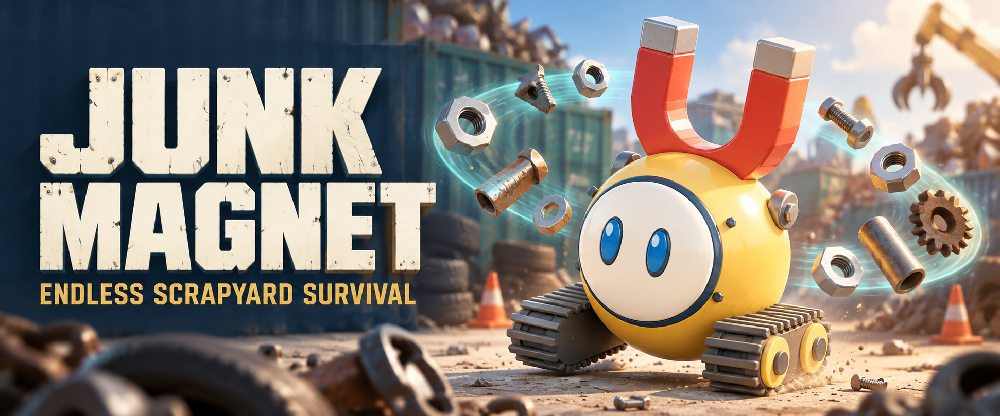

# Junk Magnet

A tiny robot. An endless scrapyard. Your enemies become your ammunition.

Collect wreckage, build an orbit of scrap, and survive increasingly chaotic waves in this 3D browser game. Online co-op is temporarily hidden while performance issues are being fixed.

**[Play Junk Magnet](https://playjunkmagnet.com)**

- **Build your scrap storm:** automatic weapons, thirteen abilities, eight weapon specializations, and three weapon evolutions.
- **Bring a helper:** switch your drone between collecting, repair, and guard roles. Upgrade each role separately across three ranks. Collector rank 3 unlocks cluster pulls, Repair rank 3 stores one emergency heal per run, and Guard rank 3 unlocks slowing shots.
- **Explore the yard:** bosses, supply chests, repair stations, and salvage contracts.
- **Upgrade between runs:** three robots, permanent workshop upgrades, and locally saved progress.
- **Play your way:** keyboard or touch, six languages, adjustable graphics, and reduced-motion support.

Built with TypeScript, Three.js, Vite, and original Blender models. Co-op runs on Node.js and WebSockets.

## Play locally

Use Node.js 22.12+ and npm.

```sh
npm ci
npm run dev
```

Open [localhost:5184/play/](http://127.0.0.1:5184/play/) and choose **Play**. The landing page, with Play and CrazyGames links, is at [localhost:5184](http://127.0.0.1:5184).

| Action | Control |
| --- | --- |
| Move | WASD, arrow keys, or drag on touch screens |
| Attack | Automatic — collect scrap to reload |
| Choose an upgrade | Click, tap, or keys 1–3 |
| Change drone role | Q or tap the helper drone card |
| Pause solo | Escape or the pause button |

Solo pauses during upgrade selection; **co-op keeps running**. Workshop progress saves in your browser, but unfinished runs do not survive a reload.

## Play together

Co-op is disabled by default. For development, enable it when building and start the co-op server:

```sh
VITE_COOP_ENABLED=true npm run build
npm run serve
```

Open [localhost:5185/play/](http://127.0.0.1:5185/play/), choose **Play Together**, and share the room code with a friend using the same hosted game. To play over the internet, deploy the Node server with WebSocket support. See [co-op setup and hosting](docs/multiplayer.md).

## Sound and music

Sound effects and music are enabled by default and start on your first interaction. Settings has independent toggles, volume sliders, and −/+ buttons for each; your preferences are remembered. Both volumes default to 50%.

The game uses 22 CC0 effects and separate menu/gameplay music loops. See [audio credits](public/licenses/audio-credits.md) for sources and licenses, and the [audio guide](docs/audio.md) for conversion, event mapping, and mixing. Run `node scripts/audio-browser.mjs` against a production preview (or set `GAME_URL`) to check playback, controls, and persistence.

## Development

```sh
npm test              # Simulation and gameplay tests
npm run test:coop     # Co-op session and server tests
npm run build         # Type-check and production build
```

[Technology and tools index](docs/technology.md) · [Asset pipeline](docs/assets.md)

[Gameplay guide](docs/gameplay.md) · [Development and artwork](docs/development.md) · [Verification notes](VERIFICATION.md)

[How the characters are built](docs/character-builds.md)

[Analytics setup and event catalog](docs/analytics.md) · [PostHog chart definitions](docs/posthog-charts.json)

[Production domain and deployment](docs/deployment.md): `playjunkmagnet.com`.

[CrazyGames release](docs/crazygames.md): `npm run publish:crazygames`.

This is a playable prototype; balancing and physical-device testing are ongoing. No accounts or ads; the CrazyGames build integrates the CrazyGames SDK for loading/gameplay events, cloud saves and muting. Third-party licenses are in [public/licenses](public/licenses/); [cover provenance](art/COVER-PROMPT.md) documents the generated promotional artwork.
